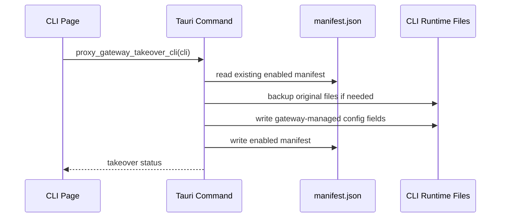
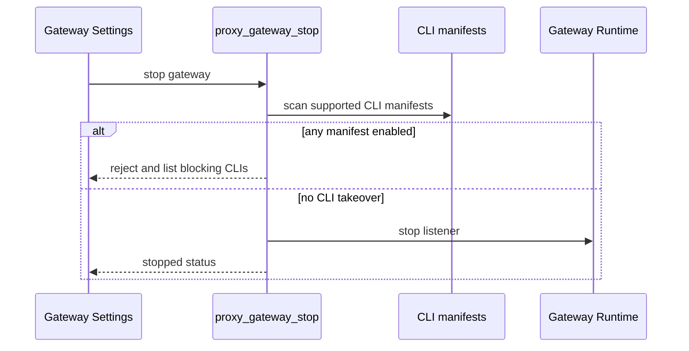

# Proxy Gateway Module Notes

## 一句话职责

- 提供本机代理网关运行态、CLI 接管状态、配置备份恢复、请求日志/统计文件和模型级健康状态。

## Source of Truth

- 全局网关设置来自 SurrealDB 的 `proxy_gateway_settings`，但 CLI 接管状态不进数据库，以 `proxy-gateway/cli-proxy/<cli>/manifest.json` 为准。
- CLI manifest 只保存接管元数据、目标文件路径、备份相对路径、hash/size 和被管理字段；不要写 provider_id、settings_config、API key 明文或上游渠道配置。
- 被接管 CLI 的真实运行时配置仍在各 CLI 自己的 runtime root：Claude Code `settings.json`、Codex `config.toml`/`auth.json`、Gemini CLI `.env`/`settings.json`。
- 请求日志、请求明细、模型健康和聚合统计属于本地文件状态；不要为了高频写入把这些内容塞进 SurrealDB。
- `ProxyGatewaySettings.enabled_on_startup` 表示上次应用退出前的网关运行态，不是用户可见的独立开关。启动成功后置 `true`，用户手动停止成功前置 `false`，应用启动时按它自动恢复网关。

## 核心设计决策（Why）

- CLI 接管使用文件 manifest，而不是数据库状态，原因是接管必须跟随本机 runtime 文件恢复，即使数据库记录损坏或迁移，仍能根据 manifest 找到备份并回滚。
- `OpenCode` adapter 暂不属于当前 MVP；不要把 `GatewayCliKey::OpenCode` 当成可接管 CLI 开启入口。
- 停止网关前必须做后端硬检查：只要存在 enabled manifest，就拒绝停止，要求先恢复对应 CLI 直连，避免用户 CLI 被留在不可用的本机网关地址上。
- 重新接管时必须复用已有 manifest 的原始备份，不要把已经被网关改写过的文件再次备份成“原始状态”。

## 关键流程

## 易错点与历史坑（Gotchas）

- 不要用 `enabled_cli_keys` 表示“当前已接管”。它只是旧设置兼容字段；实际接管状态看 manifest。
- 不要把 UI 的停止前检查当成安全边界。全局停止保护必须在 `proxy_gateway_stop` 后端命令里执行。
- 不要让保存设置时的隐藏字段把运行态恢复标记清掉。网关运行中保存设置时应保留 `enabled_on_startup=true`。
- 网关运行中保存日志/metrics 设置时必须同步更新运行态共享 settings，不能只写 SurrealDB；否则关闭 body/header 日志后重启前仍会继续落盘敏感内容。
- 控制台调试日志不等同于文件请求日志。文件请求日志必须按设置处理 headers/body 的脱敏、体积上限和保留策略；`/health` 这类健康检查不记录请求日志和 metrics。
- 请求日志、metrics rollup 和模型健康快照都只能写本地文件状态，不要写 SurrealDB；这些数据会随请求高频变化，数据库只保存网关设置这类低频配置。
- 模型健康快照只持久化非健康状态。失败进入 degraded/cooling/probing 后写快照；恢复 healthy 后移除对应条目，避免后续成功请求继续重复写快照。
- 恢复直连时只恢复本模块管理的配置字段，尽量保留 CLI runtime 自己新增的未知字段和 OAuth/token 等运行时拥有字段。
- 配置写入要继续使用各 CLI 的 runtime location 解析结果，不要硬编码 `~/.claude`、`~/.codex` 或 `~/.gemini`。

## 跨模块依赖

- 依赖 `coding::runtime_location` 解析 Claude Code、Codex、Gemini CLI 的 runtime root。
- 前端入口在各 CLI provider 列表标题后的 `GatewayTakeoverButton`；设置页只展示紧凑接管状态，并负责全局启动/停止。
- 真实请求代理依赖 provider 表、模型健康、请求日志和 metrics rollup 共同维护“按模型熔断、按供应商顺序路由”的契约：优先使用已应用 provider，再按 `sort_index` 和名称排序；模型健康处于 cooling down 时跳过对应 provider/model。
- `runtime.rs` 只承载生命周期、线程 accept 和主流程编排。HTTP 读写放 `runtime/http_io.rs`，路由匹配和 URL 拼接放 `runtime/routes.rs`，provider 读取/解析放 `runtime/providers.rs`，上游转发和 failover 放 `runtime/upstream.rs`，请求日志/metrics 采集放 `runtime/observability.rs`，控制台调试日志放 `runtime/debug_log.rs`。后续新增能力优先放入对应职责文件，不要重新堆回 `runtime.rs`。

## 最小验证

- 修改 CLI 接管/恢复逻辑后至少跑 `cd tauri && cargo test`，并覆盖三类 CLI 文件写入、恢复、重新接管不覆盖原始备份、停止保护。
- 修改请求转发、请求日志、metrics rollup 或模型健康后至少跑 `cd tauri && cargo test`，并覆盖本地文件 round trip、fallback 路由和失败健康状态更新。
- 修改前端接管入口或设置页状态后至少跑 `pnpm exec tsc --noEmit`、`pnpm test`；触及共享 UI、i18n 或构建入口时补跑 `pnpm build`。
