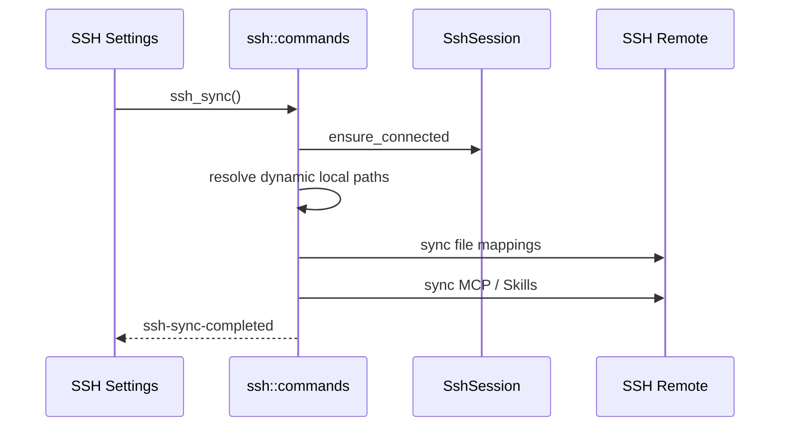

# SSH 同步模块说明

## 一句话职责

- `ssh/` 负责 SSH 连接管理、文件映射同步，以及 MCP/Skills 到远端主机的同步。

## Source of Truth

- `ssh_sync_config`、`ssh_connection`、`ssh_file_mapping` 是 SSH 配置、连接和映射的主数据；当前主存储是 SQLite JSONB，不再双写旧库。
- SSH 设置页里显示的本地路径会根据 `module_statuses` 改写成 WSL UNC 友好展示，但真正同步路径仍由后端在执行时动态解析。
- 当前仓库里，SSH 不应按“自动同步模块”理解。公开产品语义仍是手动同步为主。

## 核心设计决策（Why）

- SSH 连接状态与同步执行分离：连接由 `SshSessionState` 管理，同步只在显式触发或启用/切换连接时执行全量同步。
- 读写 SSH 配置时必须 SQLite-first；active connection、`last_sync_*` 状态、连接 CRUD、mapping CRUD 和默认 mapping backfill 都要同步更新 SQLite。
- `module_statuses` 仍会带进 SSH 配置里，是为了正确展示 WSL Direct 本地路径，而不是为了让 SSH 像 WSL 一样自动跳过或自动监听。
- MCP/Skills SSH 同步走独立链路，不复用普通文件映射，因为它们的源数据和目标路径决议不同。

## 关键流程

## 易错点与历史坑（Gotchas）

- 不要把 SSH 写成“自动同步”模块。当前应明确为手动同步主模型；即使启用或切换连接时会跑一次全量同步，也不等于存在像 WSL 那样的事件驱动自动同步监听体系。
- SSH 设置页不会像 WSL 设置页那样按 `is_wsl_direct` 禁用模块。它只是把左侧本地路径显示成完整 UNC，真正同步仍由后端解析。
- 不要只看普通 file mappings 就判断 SSH 同步是否完整。MCP 和 Skills 都走独立链路，其中 Skills 的源目录仍是中央仓库，不是某个工具当前目录。
- `ssh_sync_config.active_connection_id` 只是持久化配置，不等于进程内 `SshSession` 已恢复。冷启动后若要支持首次手动同步，必须先按已保存的 active connection 恢复 session，或在 `ssh_sync()` 里按当前 active connection 懒建连；不要把 `session.ensure_connected()` 当成会自动从数据库补回连接信息。
- 排查 SSH “没同步”时，先分三层：
  连接是否有效；
  映射和动态路径是否正确；
  MCP/Skills 独立同步链路是否执行。
- Claude Code 本机自定义根目录只改变本机源路径，不改变普通 SSH 远端目标布局；`CLAUDE_CODE_PLUGIN_CACHE_DIR` 也只改变本机 plugin 源目录。远端仍应同步到默认 `~/.claude/*`、`~/.claude/plugins`、`~/.claude/skills` 和 `~/.claude.json`；只有本机路径本身是 WSL Direct 自定义根目录时，SSH 的本地源会是 UNC，远端目标仍按后端动态解析结果处理。
- SSH 普通 file mapping 的目录模式支持按目录名配置 `directory_excludes`，默认跳过 `.git`、`.venv`、`venv`、`node_modules`、`__pycache__`、`.pytest_cache`、`.mypy_cache`、`cache`。匹配语义是目录名 segment 精确匹配，不是 glob/gitignore；非目录和 glob mapping 不应受影响。Skills 独立 SSH 目录上传也要复用同一默认排除，避免中央 Skill 内的 `.venv` 被整目录上传。
- `claude-plugins` 是目录排除默认值的例外：默认不能排除 `cache`，因为 Claude CLI 的 `installed_plugins.json` 可能把 `installPath` 指向 `~/.claude/plugins/cache/...`。如果跳过该目录，同步后的远端元数据会指向不存在的插件文件；后续不要把通用目录默认值直接套回 `claude-plugins`。
- 对 Claude `claude-plugins` 目录，同步到远端后还要修补 `known_marketplaces.json` / `installed_plugins.json` 里的 `installLocation` / `installPath`。这些字段若保留 Windows 本机路径，远端插件运行时不会自动替你转换。
- 对 JSON/TOML 单文件映射，`cleanup_paths` 是同步到 SSH 后只作用于远端目标副本的字段清理规则，不能反向改写本机源文件。Claude `claude-settings` 还会自动追加非 Windows 目标平台规则，移除 Windows-only env（`CLAUDE_CODE_USE_POWERSHELL_TOOL`、`CLAUDE_CODE_SHELL`）；`HTTP_PROXY` / `HTTPS_PROXY` / lowercase 代理 env 这类字段不应再做 SSH 全局开关，应由具体映射的 `cleanup_paths` 控制。
- Claude 插件元数据补写属于 best-effort 后处理。即使 `known_marketplaces.json` / `installed_plugins.json` 读取、改写或写回失败，也不能把已经成功完成的主文件同步整体标成失败；最多记录 warning/error 供排查。
- 写入到 `known_marketplaces.json` / `installed_plugins.json` 的 `installLocation` / `installPath` **必须是远端真实绝对 Linux 路径**，不能保留 `~/.claude/...`。Claude CLI 2.1.126+ 不会展开 JSON 字段值里的 `~`，留 `~` 会被判定 corrupted。读写文件路径可继续走 `read_remote_file` / `write_remote_file` 的 `$HOME` 展开；但作为字段**值**落盘前，必须先用 `sync::get_remote_user_home(session)` 拿到远端真实 `$HOME`，再交给重写逻辑。这条规则也覆盖以后任何往工具配置里写"远端路径字段值"的同步场景。
- Codex prompt 映射不要硬编码 active 文件名。同步 `codex-prompt` 时要镜像 `AGENTS.md` 与 `AGENTS.override.md` 两个已知文件：本机存在就同步到 SSH 同名目标，本机不存在就清理 SSH 同名目标，避免远端保留 stale override。
- Codex `config.toml` 可能通过顶层 `model_catalog_json = "ai-toolbox-codex-model-catalog.json"` 引用 AI Toolbox 生成的模型映射文件。同步 `codex-config` 时必须连带镜像这个同目录 companion JSON；但只处理 AI Toolbox 自有文件名，不要接管用户自定义的外部 catalog 路径。
- 新增通过文件映射承载 MCP 配置的工具时，不能只加默认 file mapping。还要同步更新 `mcp_sync.rs` 的 MCP 配置 mapping 白名单、进度/错误文案，以及 `cmd /c` 后处理识别。MCP 专用同步只能包含实际承载 MCP 配置的文件，不能把同模块的 env、prompt、OAuth 等普通映射一起纳入。
- bump `ssh_defaults_version` 新增默认映射时，只能 backfill 本版本新加的 mapping id。不要把所有缺失的默认 mapping 重新插回去，否则会恢复用户之前主动删除的旧默认映射；新安装空列表仍应一次性创建完整默认集合。
- SSH `auth_method = "none"` 是显式的 SSH none authentication，不等同于空密码的 password authentication。UI 仍必须要求 username；后端应调用 `authenticate_none(username)`，不要通过“密码为空”自动推断成 none。

## 跨模块依赖

- 依赖 `runtime_location`：仅用于模块状态和本地路径展示/动态路径解析。
- 依赖 `mcp_sync.rs`、`skills_sync.rs`：普通文件映射成功后再执行这两条独立链路。
- 被 `web/features/settings/` 的 SSH 设置页独占消费。

## 典型变更场景（按需）

- 新增 SSH 同步文件类型时：
  先判断它应走普通 file mappings 还是独立链路。
- 修改“启用 SSH”或“切换连接”逻辑时：
  不要顺手把它升级成事件驱动自动同步；如果真要引入，需要在产品语义上单独确认。

## 最小验证

- 至少验证：手动点击 Sync Now 会执行同步，并带出进度事件。
- 至少验证：启用 SSH 或切换 active connection 时能完成一次全量同步。
- 至少验证：WSL Direct 本地路径在 SSH 设置页显示为 UNC，但不会导致模块被禁用。
